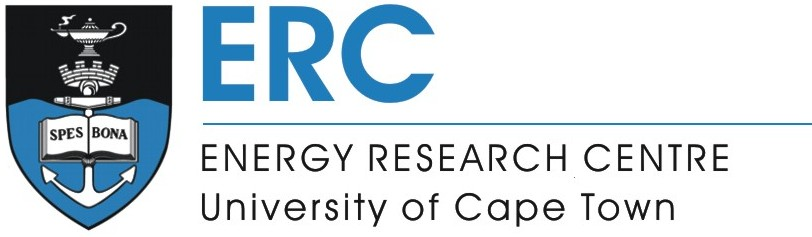

# SATIMviz
_A shiny visualisation tool to display and analyse model output results of the South African TIMES Model (SATIM)_

### Overview
This shiny application has been built to ease and improve the model construction and analysis process of SATIM for energy modellers at the UCT ERC. It can be used by others under a Creative Commons Attribution License (CC BY 3.0 ZA).  

The application can be run in two modes. The default mode is to run it locally, sourcing model files within the project's directory structure. An alternative mode exist to fetch and display datasets from the [Energy Research Data Portal for South Africa](www.energydata.uct.ac.za).

### Installation and Setup
Clone the git repository into your project's parent directory. You can find instructions on how to set up git [here](https://git-scm.com/book/en/v2/Getting-Started-Installing-Git).
```
git clone https://github.com/ERC-data/satimviz.git
```

If you want to use the application in its default local mode, it is essential that all your model output files are saved as `.rds` files in a subfolder called `RDSfiles` contained within your project parent directory. The directory structure should thus be as follows:  

```
\parent dir 
\parent dir\RDSfiles # containing all your scenarios saved as .rds files
\parent dir\satimviz # cloned from github as described above
```

### Execution
To run the visualisation locally, simply open and run `ShinyApp\ui.R` in R.

To run the CKAN compatible version, you need to replace `NULL` with your ckan dataset's ID in line 13 in the `ShinyApp\setup.R` file:
```{r}
13  dataset <- your-ckan-dataset-id
```  


